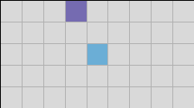
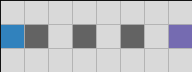
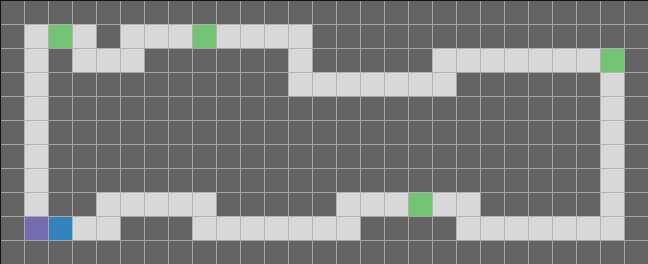
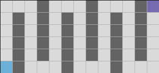
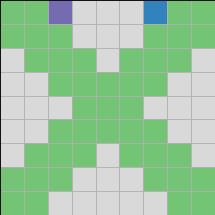
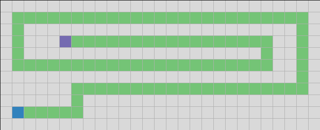
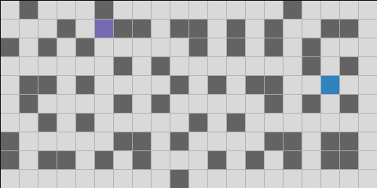
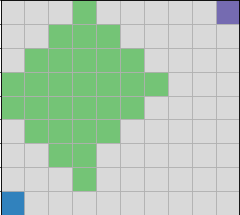
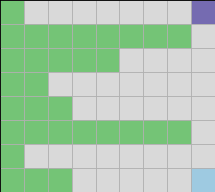

Create an Exercise
==================

As a teacher you can define your exercises by 

1. chose/create a suitable ``World``
2. and define the challenge for it. 

Chose a World
-------------

In general, you can distinguish between 

Solving a problem instance
    If the worldcreation is not randomized, you might wanna allow students to solve a specific problem instance.
    They look at the ``World`` and move ``Robo`` accordingly.
    Therefore, they do not rely on **loops**.

Solving a set of problems
    If the worldcreation is or can be randomized, you might wanna force students to solve a whole set of problems.
    For example, navigate ``Robo`` through a randomized maze (generated by ``complex_maze()``)

There are a lot of predefined worlds that can be the basis for the teachers excercises.
Use the following factory functions to make use of them.
To do call

>>> import roboworld as rw
>>> world = rw.factory_function(...)
>>> ...

Beginners
~~~~~~~~~~~~~~~~~~~~

These ``Worlds`` can be the basis for learning the concept of **method calls** and **conditionals**.
If you use fixed dimensions of the ``World``, stundents can solve those puzzels without using **loops**.

.. autofunction:: roboworld.leaf_corridor

**Example exercise:** Move ``Robo`` from the left to the right. You will encounter LEAFS (green) along the way. Pick up all the LEAFS!

**Challenge:** Students have to move ``Robo``, test for LEAFS and pick them up.

.. autofunction:: roboworld.corridor

**Example exercise:** Move ``Robo`` from the left to the right. You will encounter STONES (orange) along the way. ``Robo`` can only carry one STONE at a time.

**Challenge:** Students have to move ``Robo``, test for STONES, pick them up and put them down again. Therefore, they also have to turn ``Robo`` multiple times.

.. autofunction:: roboworld.new_world

**Example exercise:** Move ``Robo`` (blue) to its goal (purple).

**Challenge:** Students have to move ``Robo``. If the ``World`` is randomized (e.g. random goal position), students have to come up with a **search strategy**!

.. autofunction:: roboworld.tunnel

**Example exercise:** Move ``Robo`` (blue) to the tunnel exit (purple) (or entry) without using ``robo.is_at_goal()``.

**Challenge:** Students have to define the tunnel exit and entry (wall on the left and right) and test for it while walking towards the WEST.

Intermediates
~~~~~~~~~~~~~~~~~~~~

The next set of ``Worlds`` can be used to introduce **loops**.

.. autofunction:: roboworld.simple_slalom

**Example exercise:** Move ``Robo`` (blue) to its goal by passing all WALLS (dark grey) from NORTH to SOURTH or vice versa, i.e., walk a slalom!

**Challenge:** Students have to generate a slalom movement pattern using multiple left turns and move intructions.

.. autofunction:: roboworld.multi_slalom

**Example exercise:** Move ``Robo`` (blue) to its goal by passing all WALLS (dark grey) from NORTH to SOURTH or vice versa, i.e., walk a slalom!

**Challenge:** Students have to generate a slalom movement pattern using multiple left turns and move intructions.

.. autofunction:: roboworld.round_trip

**Example exercise:** Move ``Robo`` (blue) to its goal. Find and pick up all the LEAFS!

**Challenge:** Students have to generate round trip movement pattern using multiple left turns and move intructions. They have to test for LEAFS and pick them up. They should abstract a new instructions: 

+ move ``Robo`` through a right corner
+ move ``Robo`` through a left corner

.. autofunction:: roboworld.maze

**Example exercise:** Move ``Robo`` (blue) to its goal.

**Challenge:** Students have to recoginze that the required movement pattern is repetitive use this to their advantage.

.. autofunction:: roboworld.leaf_cross

**Example exercise:** Move ``Robo`` (blue) to its goal. Invert all cells, i.e. if there is no LEAF at a cell, place one. If there is a LEAF at a cell, remove it!

**Challenge:** Students have to move ``Robo`` through the whole ``World``, test for LEAFS, and invert the cells' state accordingly.
If ``Robo`` is initialized with enough LEAFS, the exercise is easier because students do not have worry about visiting to many EMPTY cells consecutively.

.. autofunction:: roboworld.pacman

**Example exercise:** Move ``Robo`` (blue) to its goal by following the path of LEAFS. 

**Challenge:** Students have to move ``Robo`` in a zig-zag movement pattern while sensoring the LEAFS accordingly.

Experts
~~~~~~~~~~~~~~~~~~~~

.. autofunction:: roboworld.complex_maze

**Example exercise 1:** Move ``Robo`` (blue) through a **randomly** generated maze to its goal (purple).

**Example exercise 2:** Let ``Robo`` (blue) compute the shortest path through the **randomly** generated maze to its goal (purple). 
After computation, move the ``Robo`` back to its starting position and walk to directly to its goal using the computed shortest path.

**Challenge 1:** Students have to develop a **dept-first search strategy**.

**Challenge 2:** Students have to develop a **breath-first search strategy**, a way to move 'backwards', a way to repeat a specific walk. 

*Hint:* The `dept-first <https://en.wikipedia.org/wiki/Depth-first_search>`_ search can be used to develop a `breath-first search <https://en.wikipedia.org/wiki/Breadth-first_search>`_ strategy.

.. autofunction:: roboworld.game_of_life

**Example exercise:** Let ``Robo`` play Conway's Game of Life. 
Update all cells accoriding to the rules by manipulating the ``World`` using ``Robo``.

**Challenge:** Students have to understand the rules of Conway's Game of Life. 
They have develop a strategy such that the parallel update character of the cells is not broken.

*Hints:* ``Robo`` has enough LEAFS put a LEAF on each cell. 
``Robo`` can ``mark`` and ``unmark`` a cell, this might be useful.

.. autofunction:: roboworld.sorting

**Example exercise:** Let ``Robo`` sort the LEAF-rows of the ``World``. 
The consecutive LEAFS of each row of the ``World`` represent a number.
Bring these rows/numbers  from bottom to top in ascending order.

**Challenge:** Students understand and implement some sorting algorithm (e.g. `bubble sort <https://en.wikipedia.org/wiki/Bubble_sort>`_ ).
They have to abstract ``Robo`` instructions in such a way that they can make use of their sorting algorithm.

Create Your Own World
--------------------------

The easiest way to construct your customized ``World`` is to use yet another factoy function.

.. autofunction:: roboworld.str_to_world

The string representation ``text`` has to be a rectangular string, i.e. a multiline string for which each line has the same length.
Furthermore, if there is no ``'G'`` (for the goal position) it will be placed at a random EMPTY position. 
If there is no ``'R'``, ``'N'``, ``'W'``, ``'S'`` or ``'E'`` the roboter will be placed at the center of the ``World``, this might be impossible thus causes an exception!

For example:

>>> import roboworld
>>> text= """############
>>> #----LL----#
>>> #----------#
>>> #----R-----#
>>> #-O--------#"""
>>>
>>> world = rw.str_to_world(text)
>>> fig = world.show(scale=0.3)
>>> fig.savefig('world-str-to-world.png')

gives us 

.. image:: ./_static/figs/world-str-to-world.png

Note that the image is mirrowed because position ``(0, 0)`` is at the **top** left.

Define the Challenge
--------------------------

Above we already propse some challenges but you are free to define your own.
It is likely that your challenges will depend on each other.
For example, in one challenge students might have to define a function to turn ``Robo`` by 180 degree - a very useful abstraction.
This function will certainly very helpful to solve many other problems.

A example stream of challenges can be found `here <https://bzoennchen.github.io/ct-book/chapters/04/robo-world.html>`_.
The text is written in German.