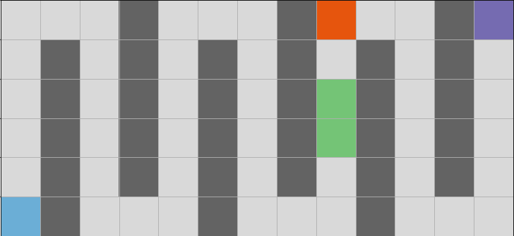

The roboworld Universe
==========================

The ``roboworld`` universe is made of the ``World``.
``World`` consists of a discrete rectangular ``Grid`` cells, a goal position, and ``Robo`` a roboter that can move from cell to cell.

Robo's World
-------------------------------------

The ``World`` can be seen as a rectangular bounded cellular automaton (a discrete rectangular ``Grid`` cells where each cell is in a state).

Each cell can be in **exactly** one of the following states:

LEAF (green)
   a leaf can be picked up by ``Robo`` if he stands on it. 
   ``Robo`` can carry an infinite amount of leafs.
   Leafs are **traversable**.
 
STONE (orange)
   a stone in front can be picked up by ``Robo`` but ``Robo`` can only carry **one** stone.
   Stones are **not traversable**.

WALL (dark grey)
   a wall is an **immovable** barrier, i.e., it is **not traversable**.

EMPTY (light grey)
   the cell is empty and **traversable**.

``Robo`` is positioned at the **blue** cell where the intensity indicates its orientation.
The goal is positioned at the **purple** cell.

Cells in the state LEAF and EMPTY are **traversable** while cells in the state STONE or WALL can not be occubied by ``Robo``.

We use the matrix-like indexing that starts from ``0``, i.e. row before column, such that ``cell[1][2]`` is the cell in the **second row** and the **third column**.

Display the World
~~~~~~~~~~~~~~~~~~~~

.. autofunction:: roboworld.World.show

.. autofunction:: roboworld.World.animate

.. hint:: 
    Instead of constructing the animation you can display it within a Jupyter notebook by calling ``roboworld.animate(world)``.

.. autofunction:: roboworld.animate

Access the World
~~~~~~~~~~~~~~~~~~~~

.. autofunction:: roboworld.World.get_robo

.. hint:: 
    It is recommended to access ``robo`` using ``world.robo`` where ``world`` is a ``World``.

.. autofunction:: roboworld.World.is_successful

.. hint::
    The goal position as well as ``Robo`` do not contribute to the state of a cell.
    Therefore, a cell in state LEAF remains in state LEAF even if ``Robo`` or the goal is positioned at this cell.

.. important:: 
    Students should only interact with ``World`` indirectly by using ``Robo``.

----------------------------------------------------------------

Robo
-------------------------------------
``Robo`` is a quite limited machine that can only execute a few basic intructions.
These instructions can be categories into movement (change yourself), self-observation (sensor yourself), observation of the world (sensor the world), world manipulations (change the world) and utilty instructions.

Movement
~~~~~~~~~~~~~~~~~~~~

.. autofunction:: roboworld.Robo.move

.. autofunction:: roboworld.Robo.turn_left

Sensor Yourself
~~~~~~~~~~~~~~~~~~~~

.. autofunction:: roboworld.Robo.is_facing_north

.. autofunction:: roboworld.Robo.is_carrying_stone

.. autofunction:: roboworld.Robo.is_carrying_leafs

Change the World
~~~~~~~~~~~~~~~~~~~~

.. autofunction:: roboworld.Robo.take_leaf

.. autofunction:: roboworld.Robo.put_leaf

.. autofunction:: roboworld.Robo.put_stone_in_front

.. autofunction:: roboworld.Robo.take_stone_in_front

.. autofunction:: roboworld.Robo.set_mark

.. autofunction:: roboworld.Robo.unset_mark

Sensor the World
~~~~~~~~~~~~~~~~~~~~

.. autofunction:: roboworld.Robo.is_wall_in_front

.. autofunction:: roboworld.Robo.is_leaf_in_front

.. autofunction:: roboworld.Robo.is_stone_in_front

.. autofunction:: roboworld.Robo.is_mark_in_front

.. autofunction:: roboworld.Robo.is_at_goal

Utility
~~~~~~~~~~~~~~~~~~~~

.. autofunction:: roboworld.Robo.toss

Students have to prorgamm more sophisticated methods by themselves by combining multiple instructions.
The learning goal is that they, step by step, build a set of functions to navigate within different ``Worlds``.
And by doing so, they hopefully pick up the most important programming fundamentals.
